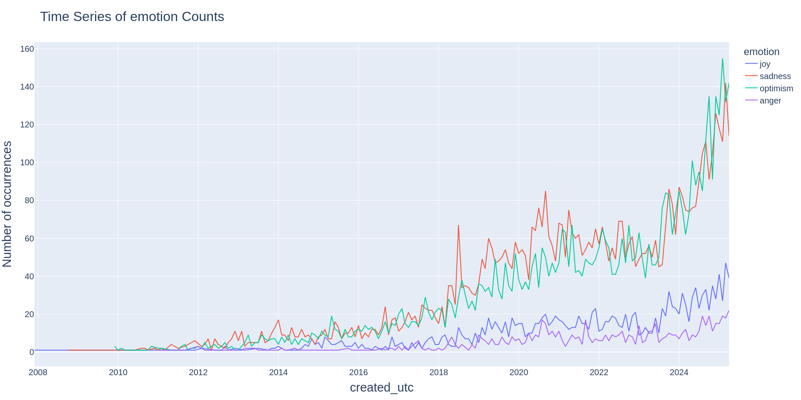
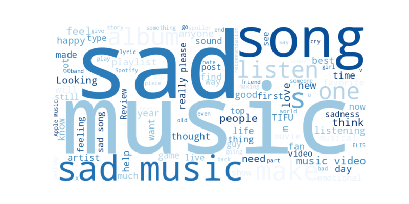

# Summary

Muse-it is an open-source platform for retrieving, processing, and visualizing large-scale Reddit discussions focused on music-related queries. It enables researchers to collect posts and comments across subreddits, apply NLP pipelines for sentiment, emotion, and theme extraction, perform topic modeling and clustering, and link discourse to Spotify content metadata via SpotDL. Muse-it lowers the barrier to mixed-methods music research by integrating social media discourse analysis with quantitative track-level features, fostering interdisciplinary investigations into music behavior in ecological settings.

# Introduction

  
*Figure 1: We introduce Muse-it, a tool to retrieve,  process, visualize, and analyze music-related Reddit discourse using search queries. Furthermore, it provides metadata of the tracks, albums, and playlists linked in the extracted data for further analysis.*

Reddit is a social media platform built around user-created communities called subreddits, where users can interact anonymously. While other platforms impose character limits or induce social desirability bias, Reddit’s anonymity encourages users to share experiences freely and openly. Users often post links to personal music choices, including playlists, providing an organic source of data on musical experiences and relationships with music.

A range of studies has demonstrated the versatility of Reddit data within MIR and music perception and cognition. For example, [@if_i_like_2024] scraped ~5000 threads from r/ifyoulikeblank to compare human and algorithmic music recommendations, highlighting extra-musical factors in human suggestions. ASMR and music-induced frisson were analyzed via Reddit comments in [@asmr_article], supporting Huron’s frisson theory[@huron_2006].

Reddit’s anonymity enables vulnerable populations to discuss sensitive topics openly. [@bhavyajeet] analyzed r/depression and r/depressionMusic to identify music-listening strategies and their acoustic and lyrical properties. [@sharon2024] examined r/autism discussions, revealing pop and electronica preferences among individuals with ASD, contrasting earlier findings. These studies showcase the value of first-person accounts in music psychology research.

The presence of subreddits also allows exploration of niche communities. Studies of genre-specific forums (e.g., metal, jazz) have examined identity construction and emotional associations[@mishra-etal-2021-metal]. [@Veselovsky_Waller_Anderson_2021] created a 1.3M-instance dataset of music sharing on Reddit, exploring macro-scale cultural dimensions of online music sharing.

Despite these insights, MIR research has yet to fully exploit Reddit data due to technical barriers in data retrieval, processing, and organization. Muse-it addresses this gap by streamlining the retrieval, analysis, and visualization of Reddit data for music research, lowering the technical barrier for interdisciplinary studies.

# Statement of Need

Researchers in musicology, cognitive science, and MIR increasingly seek to leverage social media discussions to study real-world listening behaviors and emotional responses at scale. However, assembling and processing Reddit data, integrating it with music metadata, and generating meaningful visualizations pose significant technical challenges, particularly for those without extensive computational expertise.

Existing tools such as PRAW[@praw] facilitate basic Reddit data extraction, and SpotDL[@spotDL] retrieves track metadata, but no unified framework bridges these tasks for music-focused research. Muse-it addresses this gap by offering:

- Automated retrieval of Reddit posts and comments matching custom queries across multiple subreddits.
- Optional NLP-based annotation of themes, emotions, and sentiment using TweetNLP[@camacho-collados-etal-2022-tweetnlp; @antypas2023robust].
- Topic modeling and hierarchical clustering via BERTopic[@camacho_collados_etal_2022_tweetnlp] and Sentence-BERT[@reimers-2020-multilingual-sentence-bert].
- Extraction of Spotify metadata (artist, genre, release date, popularity, lyrics) through SpotDL integration.
- A cross-platform GUI (SolidJS frontend, Flask backend) for configuring queries, filtering results, and generating interactive visualizations.

Muse-it's ability to organically combine Reddit discourse with rich track metadata from Spotify allows researchers to bridge the gap between qualitative insights and quantitative attributes. Muse-it can therefore serve as an invaluable tool for mixed-methods research in the field of musicology that empowers researchers to validate existing inferences in more ecologically valid settings and generate novel hypotheses. By lowering the technical barriers to big data analytics, Muse-it enables a broader community of researchers to explore the nuanced relationships between online discourse and music. It is also worth noting that the tool can be used by researchers outside the field of musicology for data retrieval and analysis.

# Muse-it architecture and functionality

Muse-it comprises four modules (Figure 1):

1.  **Data retrieval from Reddit** 
2.  **NLP-based metadata extraction (emotion, sentiment, topics)** 
3.  **Visualization and hierarchical topic clustering** 
4.  **Spotify track metadata extraction via SpotDL**

  
*Figure 2: Muse-it pipeline.*

## Reddit Data Retrieval

Data retrieval uses the Reddit API[@reddit_api] and PRAW[@praw]. Muse-it searches for subreddits matching a query, allows user selection, and retrieves up to 1000 posts per subreddit. Filters for date range, comments, and Spotify URLs are provided. Metadata retrieved includes subreddit name, title, body, URL, comment count, and creation time. Spotify URLs in posts and (optionally) comments are identified for later metadata extraction. Retrieval of 10,000 posts typically takes 5–10 minutes.

## Metadata Generation using NLP

Post titles are processed to generate themes, emotions, and sentiment using TweetNLP[@camacho-collados-etal-2022-tweetnlp]. Titles are favored for efficiency. NLP processing of 10,000 posts takes ~4 minutes.

  
*Figure 3: Monthly time-series of emotions for "sad music" posts.*

## Topic Clustering and Visualization

Muse-it visualizes metadata distributions and temporal trends. It uses BERTopic[@grootendorst2022bertopic] with Sentence-BERT embeddings[@reimers-2020-multilingual-sentence-bert] for hierarchical clustering and 2D topic maps. 

  
*Figure 5: Hierarchical clustering of topics.*

It also created wordcloud visualizations of the retrieved text.

  
*Figure 4: Word cloud for "sad music" posts.*

## Track Metadata Extraction

Spotify URLs are processed with SpotDL[@spotDL] to extract track, album, and playlist metadata (e.g., name, artist, album, genres, release date, lyrics). Metadata extraction of 100 tracks takes ~2 minutes; timeouts prevent excessively long processing.

## Data Download

Muse-it outputs a primary CSV (`data.csv`) with Reddit content and metadata, and separate CSVs for Spotify metadata organized by URI (Figure 6). CSV sizes vary but are typically tens of megabytes.

  
*Figure 6: Key CSV headers for Reddit and Spotify metadata.*

# Comparison to Existing Software

While PRAW provides basic Reddit API access and SpotDL handles Spotify metadata, neither offers a unified pipeline for music-focused discourse analysis for researchers. By automating the retrieval and organization of online discourse, Muse-it reduces the complexity that is traditionally associated with big data. It enables researchers to focus on extracting meaningful insights rather than grappling with data curation challenges.

# Installation

To run Muse-it, download the release from the [GitHub repository](https://github.com/george-paul/MuseIt/releases). Ensure:

**Requirements**

- Python ≥ 3.12  
- Node.js ≥ 16.0  
- FFmpeg (for SpotDL)  
- Reddit API credentials in `config.yaml`  
- SolidJS frontend and Flask backend  

**Steps**

```bash
# Extract archive
pip install -r requirements.txt   # backend
npm install                       # frontend

Populate config.yaml:
```yaml
reddit_client_id: "<your_id>"
reddit_client_secret: "<your_secret>"
metadata_extraction_timeout_minutes: 5
```

Launch:
```bash
./launch-<platform>
# e.g., launch-linux or launch-windows
```

# Usage

1. Enter search query (e.g., “sad music”), select subreddits, date range, and filters.
2. Click “Run” to retrieve and process data.
3. Explore visualizations for themes, sentiments, emotions, topics, and trends.
4. Download CSV files for further analysis.

We have created a demo of the tool along with the data used to create the visualizations, which can be found at <https://drive.google.com/drive/folders/1DtQZ7oRwrp4LPSu8-EajPTWX_l93WOs4?usp=sharing>

# Acknowledgements

We thank the developers of PRAW, SpotDL, TweetNLP, BERTopic, and Sentence-BERT for their open-source contributions.